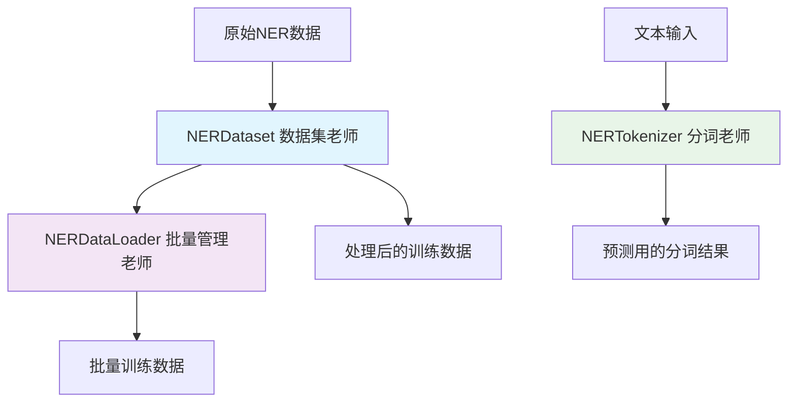
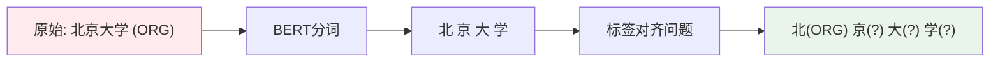
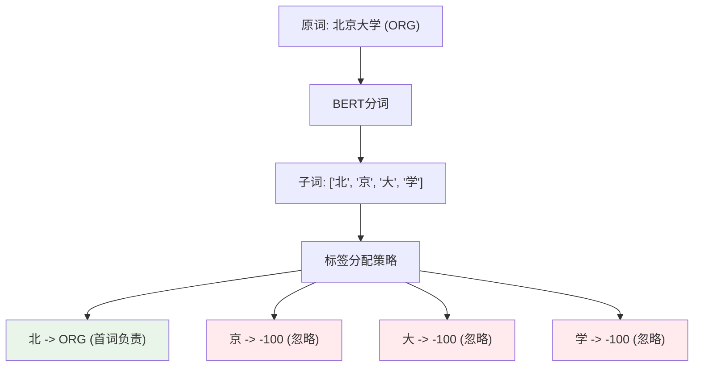
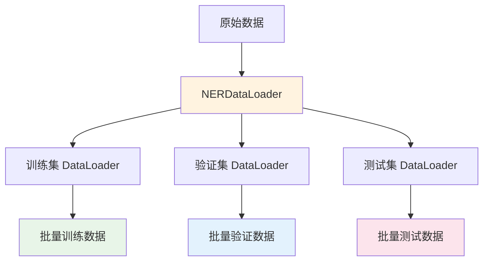
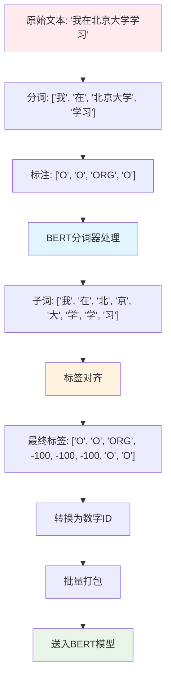

# NER数据加载器完全指南 (loader.py)

## 📖 目录

1. [这是什么？](#这是什么)
2. [为什么需要它？](#为什么需要它)
3. [核心组件详解](#核心组件详解)
4. [数据处理流程](#数据处理流程)
5. [使用示例](#使用示例)
6. [优化建议](#优化建议)
7. [常见问题](#常见问题)

## 这是什么？

想象一下，你要教一个机器人识别文本中的人名、地名等实体。就像教小孩认字一样，你需要：

1. **准备教材**（原始数据）
2. **制作卡片**（数据预处理）
3. **分批教学**（批量加载）
4. **检查理解**（标签对齐）

`loader.py` 就是这个"教学助手"，它包含三个主要的"老师"：

### 🎯 三大核心组件



## 为什么需要它？

### 🤔 核心问题：词汇切分的挑战

想象你要教机器识别"北京大学"这个词：

* **人类理解**："北京大学" = 一个完整的学校名

* **BERT理解**：可能切分成 \["北", "京", "大", "学"] 四个子词

这就产生了一个问题：原本一个标签要对应四个子词！



### 💡 解决方案：智能标签对齐

`loader.py` 采用"首词负责制"策略：

* **第一个子词**：承担完整标签 (ORG)

* **后续子词**：标记为忽略 (-100)

* **特殊符号**：也标记为忽略 (-100)

## 核心组件详解

### 1. 🏗️ NERDataset - 数据集构建师

**作用**：把原始数据转换成BERT能理解的格式

**比喻**：像一个翻译官，把人类语言翻译成机器语言

```Python
# 输入示例
example = {
    'tokens': ['我', '在', '北京大学', '学习'],
    'labels': ['O', 'O', 'ORG', 'O']
}

# 输出示例（经过tokenizer处理后）
processed = {
    'input_ids': [101, 2769, 1762, 1266, 776, 1920, 2110, 2110, 739, 102, 0, 0, ...],
    'attention_mask': [1, 1, 1, 1, 1, 1, 1, 1, 1, 1, 0, 0, ...],
    'labels': [-100, 0, 0, 1, 1, -100, -100, 0, -100, 0, 0, ...]
}
```

#### 🔧 NERDataset 方法详解

##### `__init__(examples, tokenizer, label2id, max_length=512, pad_token_label_id=-100)`

**功能**：初始化NER数据集
**比喻**：像建立一个翻译工作室，配置好所有的工具和规则

* `examples`: 原始数据列表，每个元素包含tokens和labels

* `tokenizer`: 分词器对象，负责文本切分

* `label2id`: 标签到数字的映射字典（如{'O': 0, 'B-PER': 1}）

* `max_length`: 最大序列长度，超过会截断

* `pad_token_label_id`: 填充位置的标签ID，通常为-100
  **核心逻辑**：初始化后立即调用`_process_examples()`处理所有数据
  **使用场景**：创建训练、验证或测试数据集时

##### `_process_examples()`

**功能**：批量处理所有样本（内部方法）
**比喻**：像流水线工人，逐个处理每份原材料
**处理流程**：

1. 遍历所有原始样本
2. 对每个样本调用`_tokenize_and_align_labels()`
3. 收集所有成功处理的样本
   **返回值**：处理后的样本列表
   **注意事项**：如果某个样本处理失败会被跳过

##### `_tokenize_and_align_labels(tokens, labels)`

**功能**：核心的分词和标签对齐方法
**比喻**：像精密的装配工，把零件（词汇）和标签精确对应

**🎯 "首词负责制"策略详解：**



**核心算法逻辑**：

1. **分词处理**：使用`is_split_into_words=True`保持词边界信息
2. **获取word\_ids**：每个子词对应的原始词索引
3. **标签对齐规则**：

   * `word_idx is None`: 特殊token（CLS/SEP/PAD）→ -100

   * `word_idx != previous_word_idx`: 新词的首个子词 → 分配原标签

   * `word_idx == previous_word_idx`: 同一词的后续子词 → -100

**参数说明**：

* `tokens`: 原始词汇列表

* `labels`: 对应的标签列表
  **返回值**：包含input\_ids、attention\_mask、labels等的字典
  **使用场景**：每个样本的预处理阶段

##### `_print_alignment_debug(tokenized_inputs, tokens, labels, aligned_labels)`

**功能**：调试时打印详细的对齐信息
**比喻**：像质检员，检查装配过程是否正确
**触发条件**：设置环境变量`DEBUG_ALIGNMENT=1`
**输出格式**：

```
==== DEBUG ALIGNMENT (train-time) ====
Words and labels:
我(O) 在(O) 北京大学(ORG) 学习(O)
Sub-tokens / word_id / aligned_label:
  0:                [CLS] | word_id=None | label=IGN
  1:                   我 | word_id=  0 | label=O
  2:                   在 | word_id=  1 | label=O
  3:                   北 | word_id=  2 | label=ORG
  4:                   京 | word_id=  2 | label=IGN
  ...
```

**使用场景**：调试标签对齐问题时
**注意事项**：只在第一个样本时打印一次，避免输出过多

##### `__len__()`

**功能**：返回数据集的样本数量
**比喻**：像仓库管理员报告库存数量
**返回值**：整数，表示处理后的样本总数
**使用场景**：PyTorch DataLoader需要知道数据集大小

##### `__getitem__(idx)`

**功能**：获取指定索引的样本
**比喻**：像图书管理员根据编号取书
**参数**：`idx` - 样本索引
**返回值**：包含input\_ids、attention\_mask、labels的字典
**使用场景**：PyTorch DataLoader遍历数据时调用

#### 💡 NERDataset 使用示例

```python
# 1. 准备数据
examples = [
    {'tokens': ['张', '三', '在', '北京', '工作'], 
     'labels': ['B-PER', 'I-PER', 'O', 'B-LOC', 'O']}
]

# 2. 创建标签映射
label2id = {'O': 0, 'B-PER': 1, 'I-PER': 2, 'B-LOC': 3}

# 3. 初始化分词器
from transformers import AutoTokenizer
tokenizer = AutoTokenizer.from_pretrained('bert-base-chinese', use_fast=True)

# 4. 创建数据集
dataset = NERDataset(
    examples=examples,
    tokenizer=tokenizer,
    label2id=label2id,
    max_length=128
)

# 5. 查看数据集信息
print(f"数据集大小: {len(dataset)}")
sample = dataset[0]
print(f"样本形状: input_ids={sample['input_ids'].shape}")
print(f"标签形状: labels={sample['labels'].shape}")

# 6. 开启调试模式查看对齐
import os
os.environ["DEBUG_ALIGNMENT"] = "1"
debug_dataset = NERDataset(examples, tokenizer, label2id)  # 会打印对齐信息
```

#### ⚠️ 重要注意事项

1. **分词器要求**：必须使用`use_fast=True`的快速分词器才能获取word\_ids
2. **标签对齐**：只有每个词的第一个子词承担标签，避免重复计算损失
3. **特殊token处理**：CLS、SEP、PAD等特殊token的标签都设为-100
4. **调试功能**：通过环境变量控制，避免生产环境的性能影响
5. **内存优化**：所有样本在初始化时预处理，训练时直接使用缓存结果

###### 2.  📦 NERDataLoader - 批量管理专家

**作用**：管理整个数据加载流程，创建训练、验证、测试数据集

**比喻**：像学校的教务处，负责安排不同班级的课程表

#### 🔧 方法详解

##### `__init__(tokenizer_name, label2id, max_length=512, pad_token_label_id=-100)`

**功能**：初始化数据加载器管理器
**比喻**：像设立一个教务处，配置好基本的教学规则和标准

* `tokenizer_name`: 分词器名称（如'bert-base-chinese'），决定用哪种"字典"来理解文本

* `label2id`: 标签到数字的映射表，告诉机器"人名=1，地名=2"这样的对应关系

* `max_length`: 最大文本长度，超过这个长度就"截断"，像限制作文字数

* `pad_token_label_id`: 填充位置的标签ID，通常是-100，表示"这里不用管"

##### `create_dataset(examples)`

**功能**：从原始数据创建NER数据集
**比喻**：把散乱的学习材料整理成标准的教科书

* **输入**：原始的例子列表，每个例子包含tokens和labels

* **输出**：处理好的NERDataset对象

* **使用场景**：准备训练数据时的第一步

##### `create_dataloader(dataset, batch_size=16, shuffle=True, num_workers=0)`

**功能**：创建PyTorch数据加载器
**比喻**：安排学生分批次上课，每批16个学生

* `batch_size`: 每批处理多少个样本，像每个班级的人数

* `shuffle`: 是否打乱顺序，训练时通常为True，测试时为False

* `num_workers`: 并行工作进程数，0表示单线程

* **注意**：训练时要shuffle=True避免过拟合，验证/测试时shuffle=False保证结果可重现

##### `_collate_fn(batch)`

**功能**：批量数据整理函数（内部方法）
**比喻**：把一批学生的作业整理成统一格式，方便老师批改

* **作用**：将单个样本组合成批量张量

* **处理**：确保同一批次内所有样本的维度一致

* **输出**：包含input\_ids、attention\_mask、labels的字典

##### `prepare_data_loaders(train_examples, val_examples=None, test_examples=None, batch_size=16, num_workers=0)`

**功能**：一次性准备所有需要的数据加载器
**比喻**：教务处一次性安排好所有学期的课程表

* **输入**：训练、验证、测试数据（后两者可选）

* **输出**：包含'train'、'val'、'test'键的数据加载器字典

* **优势**：一次调用解决所有数据准备工作

* **使用场景**：项目开始时的数据准备阶段

##### `get_tokenizer()`

**功能**：获取内部的分词器实例
**比喻**：借用教务处的"字典"来处理其他文本

* **返回**：配置好的tokenizer对象

* **用途**：在其他地方需要使用相同分词器时



### 3. ✂️ NERTokenizer - 分词专家

**作用**：专门处理预测时的文本分词和结果解码

**比喻**：像一个专业的同声传译，既能把话分解理解，又能把结果翻译回来

#### 🔧 方法详解

##### `__init__(tokenizer_name, max_length=512)`

**功能**：初始化NER分词器
**比喻**：培训一个专业的翻译官，教会他使用特定的字典和规则

* `tokenizer_name`: 分词器名称，决定使用哪种"语言字典"

* `max_length`: 最大处理长度，超过就"截断"，像限制翻译的句子长度

* **特点**：自动使用fast tokenizer以支持word\_ids对齐功能

* **自动处理**：如果没有pad\_token会自动设置为eos\_token

##### `tokenize_text(text)`

**功能**：将文本分词用于预测
**比喻**：把一句话拆解成词汇，并记住每个词的位置，方便后续对应

* **输入**：原始文本字符串（如"我在北京大学学习"）

* **处理过程**：

  1. 按空格分割成词汇
  2. 使用BERT分词器进一步切分
  3. 记录word\_ids用于后续对齐

* **输出**：包含input\_ids、attention\_mask、word\_ids、words的字典

* **使用场景**：模型预测前的文本预处理

##### `decode_predictions(predictions, word_ids, words, id2label)`

**功能**：将模型预测结果解码为词-标签对
**比喻**：把机器的"数字语言"翻译回人类能理解的"词汇-标签"形式

* **输入参数**：

  * `predictions`: 模型输出的预测张量（token级别）

  * `word_ids`: 词汇ID列表，用于对齐

  * `words`: 原始词汇列表

  * `id2label`: 数字到标签的映射字典

* **处理逻辑**：只保留每个词的第一个子词的预测结果

* **输出**：(词汇, 标签)元组的列表

* **使用场景**：模型预测后的结果解析

##### `batch_tokenize(texts)`

**功能**：批量处理多个文本
**比喻**：同时翻译多个句子，提高工作效率

* **输入**：文本列表

* **输出**：批量的tokenized结果

* **优势**：比逐个处理更高效

* **注意**：所有文本会被padding到相同长度

* **使用场景**：批量预测或评估时

##### `get_vocab_size()`

**功能**：获取分词器的词汇表大小
**比喻**：查看这本"字典"总共有多少个词汇

* **返回**：整数，表示词汇表中词汇的总数

* **用途**：

  * 初始化模型时设置embedding层大小

  * 检查模型和分词器的兼容性

  * 内存使用量估算

##### `get_special_tokens()`

**功能**：获取分词器的特殊标记
**比喻**：查看这本"字典"中的特殊符号，如标点符号、起始符等

* **返回**：包含各种特殊token的字典

* **包含的token**：

  * `pad_token`: 填充标记

  * `cls_token`: 分类标记（句子开始）

  * `sep_token`: 分隔标记（句子结束）

  * `unk_token`: 未知词标记

  * `mask_token`: 掩码标记（如果有）

* **用途**：调试时检查特殊token的设置

## 数据处理流程



## 使用示例

### 🚀 基础使用

#### NERDataLoader 完整使用流程

```python
# 1. 准备数据
train_examples = [
    {'tokens': ['张', '三', '在', '北京', '工作'], 
     'labels': ['B-PER', 'I-PER', 'O', 'B-LOC', 'O']},
    {'tokens': ['李', '四', '去', '上海', '出差'], 
     'labels': ['B-PER', 'I-PER', 'O', 'B-LOC', 'O']}
]

val_examples = [
    {'tokens': ['王', '五', '在', '深圳', '居住'], 
     'labels': ['B-PER', 'I-PER', 'O', 'B-LOC', 'O']}
]

# 2. 创建标签映射
label2id = {'O': 0, 'B-PER': 1, 'I-PER': 2, 'B-LOC': 3, 'I-LOC': 4}

# 3. 初始化数据加载器（相当于设立教务处）
data_loader = NERDataLoader(
    tokenizer_name='bert-base-chinese',  # 选择中文字典
    label2id=label2id,                   # 设置标签规则
    max_length=128,                      # 限制文本长度
    pad_token_label_id=-100              # 填充位置标签
)

# 4. 方法一：分步创建（适合需要自定义的场景）
train_dataset = data_loader.create_dataset(train_examples)
train_dataloader = data_loader.create_dataloader(
    train_dataset, 
    batch_size=16, 
    shuffle=True,      # 训练时打乱
    num_workers=2      # 使用2个进程加速
)

# 5. 方法二：一次性创建（推荐，简单快捷）
data_loaders = data_loader.prepare_data_loaders(
    train_examples=train_examples,
    val_examples=val_examples,
    batch_size=16,
    num_workers=2
)

# 6. 获取分词器（如果其他地方需要用）
tokenizer = data_loader.get_tokenizer()
print(f"词汇表大小: {len(tokenizer)}")

# 7. 开始训练
for epoch in range(3):
    for batch in data_loaders['train']:
        input_ids = batch['input_ids']        # [batch_size, seq_len]
        attention_mask = batch['attention_mask']  # [batch_size, seq_len]
        labels = batch['labels']              # [batch_size, seq_len]
        
        # 送入模型训练...
        # outputs = model(input_ids, attention_mask=attention_mask, labels=labels)
        # loss = outputs.loss
        print(f"批次形状: {input_ids.shape}")
```

### 🔍 NERTokenizer 预测使用

#### 单文本预测流程

```python
# 1. 初始化分词器（相当于培训翻译官）
tokenizer = NERTokenizer(
    tokenizer_name='bert-base-chinese',
    max_length=256
)

# 2. 检查分词器信息
print(f"词汇表大小: {tokenizer.get_vocab_size()}")
special_tokens = tokenizer.get_special_tokens()
print(f"特殊标记: {special_tokens}")

# 3. 处理新文本（文本预处理）
text = "王小明在清华大学读书"
print(f"原始文本: {text}")

tokenized = tokenizer.tokenize_text(text)
print(f"分词结果: {tokenized['words']}")
print(f"输入形状: {tokenized['input_ids'].shape}")
print(f"词汇对齐: {tokenized['word_ids']}")

# 4. 模型预测（假设已有训练好的模型）
# with torch.no_grad():
#     outputs = model(tokenized['input_ids'], 
#                    attention_mask=tokenized['attention_mask'])
#     predictions = torch.argmax(outputs.logits, dim=-1)

# 模拟预测结果
import torch
predictions = torch.tensor([0, 1, 2, 0, 3, 4, 4, 0])  # 模拟的预测结果

# 5. 解码结果（把数字翻译回标签）
id2label = {0: 'O', 1: 'B-PER', 2: 'I-PER', 3: 'B-ORG', 4: 'I-ORG'}
result = tokenizer.decode_predictions(
    predictions, 
    tokenized['word_ids'], 
    tokenized['words'], 
    id2label
)

print("\n🎯 最终识别结果:")
for word, label in result:
    if label != 'O':
        entity_type = label.split('-')[1] if '-' in label else label
        print(f"  {word} -> {entity_type}")
```

#### 批量文本处理

```python
# 批量处理多个文本
texts = [
    "张三在北京工作",
    "李四去上海出差",
    "王五在深圳居住"
]

# 批量分词（更高效）
batch_tokenized = tokenizer.batch_tokenize(texts)
print(f"批量输入形状: {batch_tokenized['input_ids'].shape}")

# 批量预测（假设有模型）
# with torch.no_grad():
#     batch_outputs = model(**batch_tokenized)
#     batch_predictions = torch.argmax(batch_outputs.logits, dim=-1)

# 逐个解码结果
# for i, text in enumerate(texts):
#     # 需要重新分词获取word_ids（批量分词不返回word_ids）
#     single_tokenized = tokenizer.tokenize_text(text)
#     result = tokenizer.decode_predictions(
#         batch_predictions[i], 
#         single_tokenized['word_ids'],
#         single_tokenized['words'], 
#         id2label
#     )
#     print(f"{text}: {result}")
```

## 优化建议

### 🚀 性能优化

1. **并行处理**

```python
# 增加worker数量加速数据加载
data_loader = DataLoader(dataset, num_workers=4, pin_memory=True)
```

1. **内存优化**

```python
# 使用更小的batch_size减少内存占用
batch_size = 8  # 替代默认的16
```

1. **缓存机制**

```python
# 可以添加数据预处理缓存
class CachedNERDataset(NERDataset):
    def __init__(self, *args, cache_dir=None, **kwargs):
        self.cache_dir = cache_dir
        super().__init__(*args, **kwargs)
        
    def _process_examples(self):
        # 检查缓存，避免重复处理
        if self.cache_dir and os.path.exists(f"{self.cache_dir}/processed.pkl"):
            return pickle.load(open(f"{self.cache_dir}/processed.pkl", 'rb'))
        
        processed = super()._process_examples()
        
        # 保存缓存
        if self.cache_dir:
            os.makedirs(self.cache_dir, exist_ok=True)
            pickle.dump(processed, open(f"{self.cache_dir}/processed.pkl", 'wb'))
            
        return processed
```

### 🎯 功能增强

1. **动态padding**

```python
def dynamic_collate_fn(batch):
    """动态padding，只padding到当前batch的最大长度"""
    max_len = max(len(item['input_ids']) for item in batch)
    # 实现动态padding逻辑...
```

1. **数据增强**

```python
class AugmentedNERDataset(NERDataset):
    def __init__(self, *args, augment_prob=0.1, **kwargs):
        self.augment_prob = augment_prob
        super().__init__(*args, **kwargs)
    
    def __getitem__(self, idx):
        item = super().__getitem__(idx)
        
        # 随机数据增强
        if random.random() < self.augment_prob:
            item = self._augment_example(item)
            
        return item
```

1. **多GPU支持**

```python
# 使用DistributedSampler支持多GPU训练
from torch.utils.data.distributed import DistributedSampler

sampler = DistributedSampler(dataset) if torch.distributed.is_initialized() else None
data_loader = DataLoader(dataset, sampler=sampler, batch_size=batch_size)
```

### 📊 监控和调试

1. **数据质量检查**

```python
def validate_dataset(dataset):
    """检查数据集质量"""
    for i, example in enumerate(dataset):
        # 检查标签对齐
        assert len(example['labels']) == len(example['input_ids'])
        
        # 检查特殊token标签
        if example['input_ids'][0] == tokenizer.cls_token_id:
            assert example['labels'][0] == -100
            
        print(f"Example {i} validated")
```

1. **性能监控**

```python
import time

class TimedDataLoader:
    def __init__(self, dataloader):
        self.dataloader = dataloader
        
    def __iter__(self):
        for batch in self.dataloader:
            start_time = time.time()
            yield batch
            load_time = time.time() - start_time
            if load_time > 0.1:  # 如果加载时间超过100ms
                print(f"Slow batch loading: {load_time:.3f}s")
```

## 常见问题

### ❓ Q1: 为什么有些标签是-100？

**A**: -100是PyTorch中的特殊值，表示在计算损失时忽略这些位置。主要用于：

* 子词的非首位置（避免重复计算同一个词的损失）

* 特殊符号位置（\[CLS], \[SEP], \[PAD]等）

### ❓ Q2: 如何处理长文本？

**A**: 有几种策略：

1. **截断**：超过max\_length的部分直接丢弃
2. **滑动窗口**：将长文本分成多个重叠的片段
3. **分层处理**：先分句，再对每句进行NER

### ❓ Q3: 标签对齐出错怎么办？

**A**: 开启调试模式：

```python
import os
os.environ["DEBUG_ALIGNMENT"] = "1"
# 这会打印详细的对齐信息
```

### ❓ Q4: 如何处理不平衡的标签分布？

**A**: 可以使用加权损失：

```python
from sklearn.utils.class_weight import compute_class_weight

# 计算类别权重
class_weights = compute_class_weight('balanced', 
                                   classes=np.unique(all_labels), 
                                   y=all_labels)
weight_tensor = torch.FloatTensor(class_weights)

# 在损失函数中使用
criterion = nn.CrossEntropyLoss(weight=weight_tensor, ignore_index=-100)
```

### ❓ Q5: NERDataLoader和NERTokenizer有什么区别？

**A**: 两者分工不同：

* **NERDataLoader**: 专门用于训练阶段，处理带标签的数据，创建训练/验证/测试数据集

* **NERTokenizer**: 专门用于预测阶段，处理新文本，解码模型输出

* **比喻**: DataLoader像"学校教务处"，Tokenizer像"翻译官"

### ❓ Q6: 为什么batch\_tokenize不返回word\_ids？

**A**: 因为批量处理时：

* 不同文本的词汇数量不同，word\_ids无法统一对齐

* 批量处理主要用于提高效率，不需要详细的对齐信息

* 如果需要word\_ids，应该使用tokenize\_text逐个处理

### ❓ Q7: 如何选择合适的batch\_size？

**A**: 考虑以下因素：

* **内存限制**: GPU内存不足时减小batch\_size

* **训练稳定性**: 太小的batch\_size可能导致训练不稳定

* **推荐值**:

  * 小模型(BERT-base): 16-32

  * 大模型(BERT-large): 8-16

  * 显存不足时: 4-8

### ❓ Q8: num\_workers设置多少合适？

**A**: 根据CPU核心数设置：

* **推荐**: CPU核心数的1/2到2/3

* **Windows系统**: 建议设为0（单进程），避免多进程问题

* **Linux系统**: 可以设为2-8

* **注意**: 过多的worker可能导致内存占用过高

***

## 🎉 总结

`loader.py` 是NER项目的"数据管家"，它解决了从原始文本到模型输入的所有转换问题。通过理解其三大组件的分工合作，你就能更好地：

1. **调试数据问题** - 知道在哪个环节出了问题
2. **优化性能** - 针对性地改进瓶颈环节
3. **扩展功能** - 基于现有架构添加新特性

记住：好的数据加载器是成功NER模型的基石！🏗️
