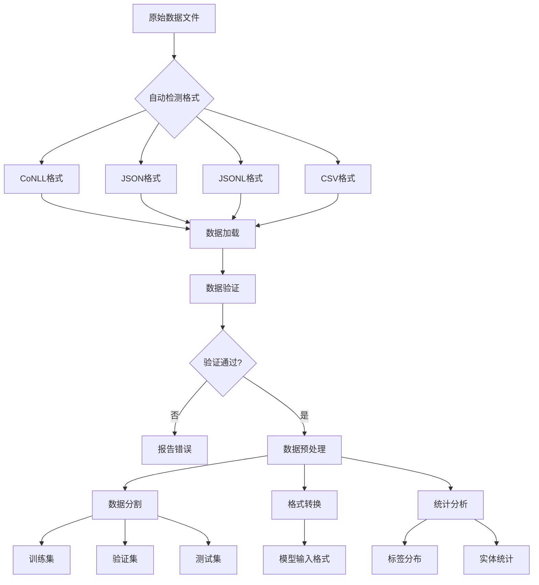
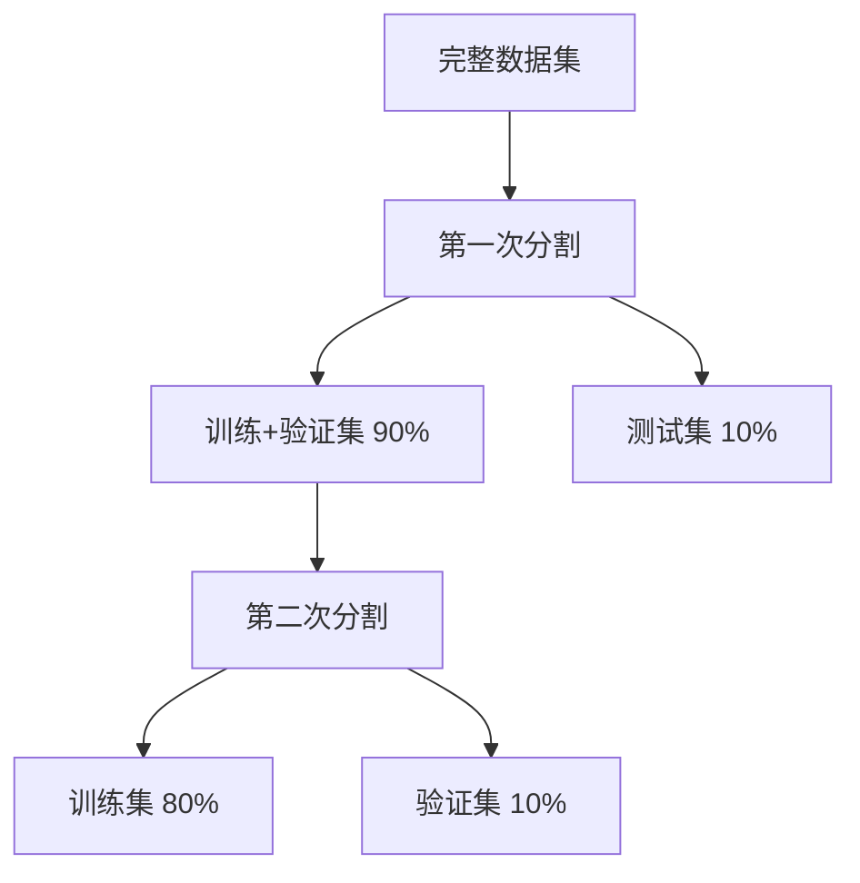

# NER 数据处理器详解 (NERDataProcessor)

## 📖 概述

`NERDataProcessor` 是 NER 项目中的数据处理核心类，就像一个多功能的数据工厂，负责将各种格式的原始数据转换成模型可以理解和使用的标准格式。

### 🎯 主要功能
- **数据加载**：支持多种格式（CoNLL、JSON、JSONL、CSV）
- **数据验证**：确保数据格式正确和标签一致性
- **数据预处理**：清洗和标准化数据
- **数据分割**：将数据分为训练集、验证集和测试集
- **格式转换**：在不同数据格式间转换
- **统计分析**：提供数据集的统计信息
- **实体提取**：从标注序列中提取实体信息

## 🏗️ 数据处理流程



## 🔧 核心方法详解

### 1. 初始化方法

#### `__init__(self, config: Optional[Dict[str, Any]] = None)`

**功能**：初始化数据处理器，设置配置参数

**参数**：
- `config`: 配置字典，包含标签、编码、最大长度等设置

**使用场景**：创建处理器实例时

**⚠️ 重要问题：配置结构不匹配**

**问题描述**：
当前代码中的标签获取方式存在问题：
```python
# 当前代码（有问题）
self.labels = self.config.get('labels', {}).get('entities', [])
```

这行代码试图从配置的 `labels.entities` 获取实体列表，但实际配置文件中的结构是：

```json
"labels": {
    "num_labels": 17,
    "scheme": "BIO",
    "label_names": [
        "O",
        "B-COUNTRY", "I-COUNTRY",
        "B-EMIRATE", "I-EMIRATE",
        "B-CITY", "I-CITY",
        "B-SUB_AREA", "I-SUB_AREA",
        "B-COMPOUND", "I-COMPOUND",
        "B-STREET", "I-STREET",
        "B-BUILDING", "I-BUILDING",
        "B-HOUSE_NUMBER", "I-HOUSE_NUMBER"
    ],
    "label_mapping": {
        "O": 0,
        "B-COUNTRY": 1,
        "I-COUNTRY": 2,
        // ... 更多映射
    }
}
```

**问题影响**：
- `self.labels` 会是空列表 `[]`
- `_init_label_mappings()` 方法无法正确生成标签映射
- 数据验证功能失效

**修复方案**：

**方案一：从 label_names 提取实体类型**
```python
def __init__(self, config: Optional[Dict[str, Any]] = None):
    self.config = config or {}
    
    # 修复：从 label_names 提取实体类型
    label_names = self.config.get('labels', {}).get('label_names', [])
    self.labels = self._extract_entity_types(label_names)
    
    self.label_scheme = self.config.get('labels', {}).get('scheme', 'BIO')
    self.max_length = self.config.get('data', {}).get('max_length', 512)
    self.encoding = self.config.get('data', {}).get('encoding', 'utf-8')
    
    # 使用配置中的现成映射或生成新映射
    self._init_label_mappings()

def _extract_entity_types(self, label_names: List[str]) -> List[str]:
    """从 BIO 标签列表中提取实体类型"""
    entity_types = set()
    for label in label_names:
        if label.startswith('B-') or label.startswith('I-'):
            entity_type = label[2:]  # 去掉 'B-' 或 'I-' 前缀
            entity_types.add(entity_type)
    return list(entity_types)
```

**方案二：直接使用配置中的映射**
```python
def __init__(self, config: Optional[Dict[str, Any]] = None):
    self.config = config or {}
    
    # 直接使用配置中的标签映射
    labels_config = self.config.get('labels', {})
    self.label2id = labels_config.get('label_mapping', {})
    self.id2label = {v: k for k, v in self.label2id.items()}
    
    # 提取实体类型用于验证
    label_names = labels_config.get('label_names', [])
    self.labels = self._extract_entity_types(label_names)
    
    self.label_scheme = labels_config.get('scheme', 'BIO')
    self.max_length = self.config.get('data', {}).get('max_length', 512)
    self.encoding = self.config.get('data', {}).get('encoding', 'utf-8')

def _extract_entity_types(self, label_names: List[str]) -> List[str]:
    """从 BIO 标签列表中提取实体类型"""
    entity_types = set()
    for label in label_names:
        if label.startswith('B-') or label.startswith('I-'):
            entity_type = label[2:]
            entity_types.add(entity_type)
    return list(entity_types)
```

**推荐使用方案二**，因为：
1. 直接使用配置文件中的现成映射，避免重复计算
2. 保持与配置文件的一致性
3. 性能更好，不需要重新生成映射

**修复后的完整示例**：
```python
# 使用修复后的配置
with open('config.json', 'r') as f:
    config = json.load(f)

processor = NERDataProcessor(config)
print(f"实体类型: {processor.labels}")  # ['COUNTRY', 'EMIRATE', 'CITY', ...]
print(f"标签映射: {processor.label2id}")  # {'O': 0, 'B-COUNTRY': 1, ...}
```

#### `_init_label_mappings(self)`

**功能**：初始化标签到ID的映射关系

**⚠️ 配置相关问题**：
这个方法依赖于 `self.labels` 来生成映射，但由于上述配置问题，当前实现可能无法正常工作。

**当前实现的问题**：
```python
def _init_label_mappings(self):
    """Initialize label to ID mappings"""
    if self.labels:  # 这里 self.labels 可能是空列表
        # Create BIO tags for each entity
        bio_labels = ['O']  # Outside
        for entity in self.labels:
            bio_labels.extend([f'B-{entity}', f'I-{entity}'])
        
        self.label2id = {label: idx for idx, label in enumerate(bio_labels)}
        self.id2label = {idx: label for label, idx in self.label2id.items()}
    else:
        self.label2id = {}
        self.id2label = {}
```

**修复后的实现**：
```python
def _init_label_mappings(self):
    """Initialize label to ID mappings"""
    labels_config = self.config.get('labels', {})
    
    # 优先使用配置文件中的现成映射
    if 'label_mapping' in labels_config:
        self.label2id = labels_config['label_mapping']
        self.id2label = {v: k for k, v in self.label2id.items()}
    elif self.labels:  # 备用方案：从实体类型生成
        bio_labels = ['O']
        for entity in self.labels:
            bio_labels.extend([f'B-{entity}', f'I-{entity}'])
        
        self.label2id = {label: idx for idx, label in enumerate(bio_labels)}
        self.id2label = {idx: label for label, idx in self.label2id.items()}
    else:
        self.label2id = {}
        self.id2label = {}
```

**使用场景**：
- 在 `__init__` 方法中自动调用
- 为数据验证和模型训练提供标签映射

**注意事项**：
- 修复后优先使用配置文件中的 `label_mapping`
- 确保映射的一致性和正确性
- 支持向后兼容，如果没有现成映射则自动生成

### 2. 数据加载方法

#### `_load_conll_file(self, file_path: str) -> List[Dict[str, Any]]`

**功能**：加载 CoNLL 格式文件（最常用的 NER 数据格式）

**比喻**：就像读取一本按行排列的词典，每行包含一个词和它的标签，空行表示句子结束。

**参数**：
- `file_path`: CoNLL 文件路径

**返回值**：包含 tokens、labels、text 的示例列表

**CoNLL 格式示例**：
```
张	B-PER
三	I-PER
在	O
北京	B-LOC
工作	O

李	B-PER
四	I-PER
```

**注意事项**：
- 空行分隔不同句子
- 最后一列是标签
- 支持多列格式，自动取最后一列作为标签

#### `_load_json_file(self, file_path: str) -> List[Dict[str, Any]]`

**功能**：加载 JSON 格式文件

**比喻**：就像读取一个结构化的数据库，每条记录都有明确的字段名称。

**支持的 JSON 格式**：
```json
[
  {
    "tokens": ["张", "三", "在", "北京", "工作"],
    "labels": ["B-PER", "I-PER", "O", "B-LOC", "O"],
    "text": "张三在北京工作"
  }
]
```

或者：
```json
{
  "examples": [
    {
      "tokens": [...],
      "labels": [...]
    }
  ]
}
```

#### `_load_jsonl_file(self, file_path: str) -> List[Dict[str, Any]]`

**功能**：加载 JSON Lines 格式文件（每行一个 JSON 对象）

**比喻**：就像一个流水线，每行都是一个独立的数据包。

**JSONL 格式示例**：
```
{"tokens": ["张", "三"], "labels": ["B-PER", "I-PER"]}
{"tokens": ["李", "四"], "labels": ["B-PER", "I-PER"]}
```

**优势**：
- 适合大数据集
- 支持流式处理
- 每行独立，不易出错

#### `_load_csv_file(self, file_path: str) -> List[Dict[str, Any]]`

**功能**：加载 CSV 格式文件

**比喻**：就像 Excel 表格，每行是一个样本，每列是一个属性。

**CSV 格式示例**：
```csv
text,tokens,labels
"张三在北京工作","[\"张\", \"三\", \"在\", \"北京\", \"工作\"]","[\"B-PER\", \"I-PER\", \"O\", \"B-LOC\", \"O\"]"
```

#### `load_data_file(self, file_path: str) -> List[Dict[str, Any]]`

**功能**：智能加载数据文件（自动检测格式）

**比喻**：就像一个万能钥匙，能自动识别并打开不同类型的锁。

**自动检测逻辑**：
1. 根据文件扩展名判断
2. 如果扩展名不明确，读取第一行内容
3. 根据内容特征判断格式

**使用场景**：不确定文件格式时的首选方法

### 3. 数据验证方法

#### `validate_data_file(self, file_path: str) -> bool`

**功能**：验证数据文件的格式和内容是否正确

**比喻**：就像质检员，检查产品是否符合标准。

**验证内容**：
- 文件是否能正确加载
- 数据格式是否符合要求
- 标签序列是否有效

#### `validate_examples(self, examples: List[Dict[str, Any]]) -> bool`

**功能**：验证示例列表的有效性

**验证项目**：
- 必需字段检查（tokens、labels）
- tokens 和 labels 长度一致性
- 标签有效性检查
- BIO 序列一致性检查

**代码示例**：
```python
examples = [
    {
        'tokens': ['张', '三', '在', '北京'],
        'labels': ['B-PER', 'I-PER', 'O', 'B-LOC']
    }
]

if processor.validate_examples(examples):
    print("数据验证通过")
else:
    print("数据验证失败")
```

#### `_validate_bio_sequence(self, labels: List[str]) -> bool`

**功能**：验证 BIO 标签序列的一致性

**比喻**：就像检查句子的语法，确保 I- 标签前面有对应的 B- 标签。

**BIO 规则**：
- I-标签必须跟在相同实体类型的 B- 或 I- 标签后面
- 不能以 I- 标签开头
- 实体类型必须一致

**错误示例**：
```python
# 错误：以 I- 开头
['I-PER', 'O']  # ❌

# 错误：实体类型不一致
['B-PER', 'I-LOC']  # ❌

# 正确示例
['B-PER', 'I-PER', 'O', 'B-LOC']  # ✅
```

### 4. 数据处理方法

#### `process_file(self, input_file: str, output_file: str, format: str = 'json')`

**功能**：处理并转换数据文件

**比喻**：就像一个数据加工厂，将原材料加工成标准产品。

**处理流程**：


**参数**：
- `input_file`: 输入文件路径
- `output_file`: 输出文件路径
- `format`: 输出格式（'json', 'conll', 'csv'）

#### `preprocess_example(self, example: Dict[str, Any]) -> Optional[Dict[str, Any]]`

**功能**：预处理单个样本

**比喻**：就像洗菜，去除不好的部分，保留干净的部分。

**预处理步骤**：
1. **长度过滤**：超过最大长度的截断
2. **清洗 tokens**：去除空白字符
3. **同步处理**：确保 tokens 和 labels 保持对应
4. **有效性检查**：过滤空样本

**代码示例**：
```python
example = {
    'tokens': ['  张', '三  ', '', '在', '北京'],
    'labels': ['B-PER', 'I-PER', 'O', 'O', 'B-LOC']
}

processed = processor.preprocess_example(example)
# 结果：{'tokens': ['张', '三', '在', '北京'], 'labels': ['B-PER', 'I-PER', 'O', 'B-LOC']}
```

### 5. 数据分割方法

#### `split_data(self, input_file: str, output_dir: str, train_ratio: float = 0.8, val_ratio: float = 0.1, test_ratio: float = 0.1, random_state: int = 42)`

**功能**：将数据集分割为训练集、验证集和测试集

**比喻**：就像分蛋糕，按比例切成三块，每块用于不同目的。

**分割策略**：


**参数说明**：
- `train_ratio`: 训练集比例（默认 0.8）
- `val_ratio`: 验证集比例（默认 0.1）
- `test_ratio`: 测试集比例（默认 0.1）
- `random_state`: 随机种子，确保结果可重现

**输出文件**：
- `train.json`: 训练集
- `val.json`: 验证集
- `test.json`: 测试集

## 🚀 使用最佳实践

### 1. 数据加载最佳实践

```python
# 推荐：使用自动检测
try:
    examples = processor.load_data_file('data.txt')
    print(f"成功加载 {len(examples)} 个样本")
except Exception as e:
    print(f"加载失败：{e}")

# 验证数据
if processor.validate_examples(examples):
    print("数据验证通过")
else:
    print("数据存在问题，请检查")
```

### 2. 数据预处理流程

```python
# 完整的数据处理流程
def process_ner_data(input_file, output_dir):
    # 1. 初始化处理器
    config = {
        'labels': {'entities': ['PER', 'LOC', 'ORG'], 'scheme': 'BIO'},
        'data': {'max_length': 256}
    }
    processor = NERDataProcessor(config)
    
    # 2. 验证输入文件
    if not processor.validate_data_file(input_file):
        raise ValueError("输入文件验证失败")
    
    # 3. 处理并分割数据
    processor.split_data(
        input_file=input_file,
        output_dir=output_dir,
        train_ratio=0.8,
        val_ratio=0.1,
        test_ratio=0.1
    )
    
    # 4. 获取统计信息
    examples = processor.load_data_file(f"{output_dir}/train.json")
    stats = processor.get_label_statistics(examples)
    print(f"训练集统计：{stats}")
```

### 3. 错误处理和调试

```python
# 调试数据问题
def debug_data_issues(file_path):
    processor = NERDataProcessor()
    
    try:
        examples = processor.load_data_file(file_path)
        print(f"加载了 {len(examples)} 个样本")
        
        # 检查每个样本
        for i, example in enumerate(examples[:5]):  # 只检查前5个
            print(f"样本 {i}:")
            print(f"  Tokens: {example['tokens'][:10]}...")  # 只显示前10个
            print(f"  Labels: {example['labels'][:10]}...")
            
            # 验证单个样本
            if not processor.validate_examples([example]):
                print(f"  ⚠️ 样本 {i} 存在问题")
            else:
                print(f"  ✅ 样本 {i} 正常")
                
    except Exception as e:
        print(f"处理失败：{e}")
```

## ⚠️ 常见问题和解决方案

### 1. 文件编码问题

**问题**：加载文件时出现编码错误

**解决方案**：
```python
# 指定正确的编码
config = {'data': {'encoding': 'utf-8'}}  # 或 'gbk', 'latin-1'
processor = NERDataProcessor(config)
```

### 2. BIO 标签不一致

**问题**：I- 标签前没有对应的 B- 标签

**解决方案**：
```python
# 修复 BIO 序列
def fix_bio_sequence(labels):
    fixed_labels = []
    for i, label in enumerate(labels):
        if label.startswith('I-'):
            entity_type = label[2:]
            if i == 0 or not (fixed_labels[-1] == f'B-{entity_type}' or 
                             fixed_labels[-1] == f'I-{entity_type}'):
                # 将 I- 改为 B-
                fixed_labels.append(f'B-{entity_type}')
            else:
                fixed_labels.append(label)
        else:
            fixed_labels.append(label)
    return fixed_labels
```

### 3. 内存使用优化

**问题**：处理大文件时内存不足

**解决方案**：
```python
# 分批处理大文件
def process_large_file(file_path, batch_size=1000):
    processor = NERDataProcessor()
    
    # 使用生成器逐批加载
    def batch_generator():
        examples = processor.load_data_file(file_path)
        for i in range(0, len(examples), batch_size):
            yield examples[i:i+batch_size]
    
    # 分批处理
    for batch_idx, batch in enumerate(batch_generator()):
        processed_batch = []
        for example in batch:
            processed = processor.preprocess_example(example)
            if processed:
                processed_batch.append(processed)
        
        # 保存批次结果
        processor.save_examples(
            processed_batch, 
            f'output_batch_{batch_idx}.json'
        )
```

## 📊 性能优化建议

### 1. 文件格式选择
- **小数据集**：JSON 格式，易读易调试
- **大数据集**：JSONL 格式，支持流式处理
- **标准格式**：CoNLL 格式，兼容性好

### 2. 内存优化
- 使用生成器处理大文件
- 及时释放不需要的变量
- 分批处理避免内存溢出

### 3. 处理速度优化
- 预编译正则表达式
- 使用向量化操作
- 缓存重复计算结果

## 🎓 总结

`NERDataProcessor` 是 NER 项目的数据处理核心，提供了完整的数据处理流水线：

1. **多格式支持**：自动识别和加载各种数据格式
2. **严格验证**：确保数据质量和标签一致性
3. **智能预处理**：清洗和标准化数据
4. **灵活分割**：支持自定义比例的数据分割

通过合理使用这些功能，可以高效地处理 NER 数据，为模型训练提供高质量的输入。记住，好的数据是成功的一半！