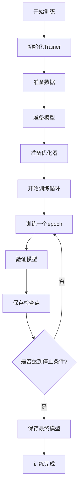
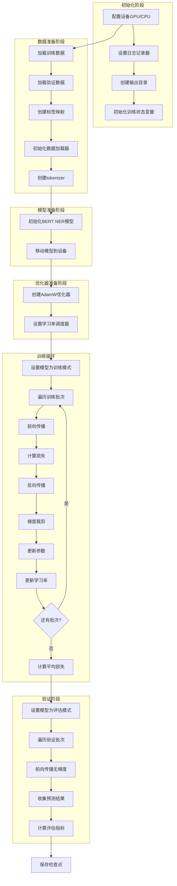
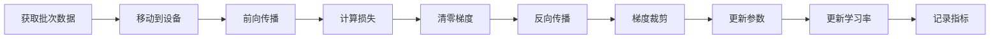

# NER模型训练流程详细指南

本文档详细描述了 `src/ner/training/trainer.py` 中NER模型的训练流程，帮助新人快速理解训练过程和优化方法。

## 1. 训练流程概览

### 1.1 整体架构



### 1.2 详细训练流程



## 2. 核心组件详细说明

### 2.1 NERTrainer类初始化

**功能**: 设置训练环境和初始化训练状态

**关键步骤**:
- 配置日志记录器
- 自动检测和设置训练设备(GPU/CPU)
- 初始化训练历史记录
- 设置早停机制参数
- 创建输出和检查点目录

**设备选择逻辑**:
```python
# 支持的设备配置选项
'auto'     # 自动选择：优先GPU，无GPU则CPU
'cuda'     # 强制使用GPU
'cpu'      # 强制使用CPU
'cuda:0'   # 指定GPU设备
```

### 2.2 数据准备 (prepare_data)

**功能**: 加载和预处理训练数据

**详细流程**:
1. **数据加载**: 使用NERDataProcessor加载训练和验证文件
2. **标签处理**: 支持两种标签格式
   - `entities`: 实体列表，自动生成BIO标签
   - `label_names`: 直接提供BIO标签列表
3. **标签映射**: 创建label2id和id2label映射
4. **数据加载器**: 创建PyTorch DataLoader
5. **分词器**: 初始化对应的tokenizer

**标签格式示例**:
```python
# 方式1: entities格式
"entities": ["PER", "LOC", "ORG"]
# 生成: ["O", "B-PER", "I-PER", "B-LOC", "I-LOC", "B-ORG", "I-ORG"]

# 方式2: label_names格式
"label_names": ["O", "B-PER", "I-PER", "B-LOC", "I-LOC"]
```

### 2.3 模型准备 (prepare_model)

**功能**: 初始化和配置NER模型

**支持的模型类型**:
- **BERT**: 基于预训练BERT的NER模型
- 可扩展支持其他Transformer模型

**关键配置**:
- `pretrained_model`: 预训练模型名称
- `num_labels`: 标签数量
- `dropout`: Dropout比率

### 2.4 优化器准备 (prepare_optimizer)

**功能**: 配置优化器和学习率调度器

**优化器选项**:
- **AdamW**: 默认优化器，适合Transformer模型
- 支持权重衰减(weight_decay)

**学习率调度器**:
- **Linear**: 线性衰减，带预热阶段
- **Cosine**: 余弦退火调度
- **None**: 固定学习率

**预热机制**:
```python
warmup_steps = total_steps * warmup_ratio  # 默认10%
```

### 2.5 训练循环 (train_epoch)

**单个epoch的训练流程**:



**关键技术**:
- **梯度裁剪**: 防止梯度爆炸，默认最大范数为1.0
- **进度条**: 实时显示训练进度和指标
- **批次日志**: 每100个批次记录详细信息

### 2.6 验证过程 (validate)

**功能**: 评估模型在验证集上的性能

**评估指标**:
- **实体级别指标**: 精确率、召回率、F1分数
- **Token级别指标**: Token准确率、精确率、召回率、F1
- **每实体指标**: 各实体类型的详细指标

**评估流程**:
1. 设置模型为评估模式
2. 禁用梯度计算
3. 收集真实标签和预测标签序列
4. 使用seqeval计算实体级别指标
5. 计算token级别指标

### 2.7 检查点管理 (save_checkpoint)

**保存内容**:
- 模型状态字典
- 优化器状态
- 学习率调度器状态
- 训练指标和历史
- 配置信息
- 标签映射

**检查点类型**:
- **常规检查点**: `checkpoint_epoch_{epoch}.pt`
- **最佳检查点**: `best_checkpoint.pt` (基于验证F1分数)
- **最新检查点**: `latest_checkpoint.pt`

### 2.8 最终模型保存 (save_final_model)

**保存格式**: 兼容Hugging Face Transformers

**保存文件**:
- `pytorch_model.bin`: 模型权重
- `config.json`: 模型配置
- `tokenizer.json`: 分词器配置
- `training_metadata.json`: 训练元数据

## 3. 训练监控和日志

### 3.1 训练历史记录

系统自动记录以下指标:
- 训练损失 (`train_loss`)
- 验证损失 (`val_loss`)
- 验证F1分数 (`val_f1`)
- 验证精确率 (`val_precision`)
- 验证召回率 (`val_recall`)
- 学习率变化 (`learning_rates`)

### 3.2 早停机制

**触发条件**: 验证F1分数连续N个epoch未改善
**默认耐心值**: 5个epoch
**监控指标**: 验证F1分数

## 4. 配置参数详解

### 4.1 硬件配置
```json
{
  "hardware": {
    "device": "auto",        // 设备选择
    "num_workers": 4         // 数据加载进程数
  }
}
```

### 4.2 训练配置
```json
{
  "training": {
    "epochs": 10,                    // 训练轮数
    "batch_size": 16,               // 批次大小
    "learning_rate": 2e-5,          // 学习率
    "weight_decay": 0.01,           // 权重衰减
    "optimizer": "adamw",           // 优化器
    "scheduler": "linear",          // 学习率调度器
    "warmup_ratio": 0.1,            // 预热比例
    "max_grad_norm": 1.0,           // 梯度裁剪
    "early_stopping_patience": 5    // 早停耐心值
  }
}
```

### 4.3 模型配置
```json
{
  "model": {
    "type": "bert",                           // 模型类型
    "pretrained_model": "bert-base-uncased",  // 预训练模型
    "dropout": 0.1                            // Dropout比率
  }
}
```

### 4.4 数据配置
```json
{
  "data": {
    "train_file": "path/to/train.json",  // 训练文件
    "val_file": "path/to/val.json",      // 验证文件
    "max_length": 512                     // 最大序列长度
  }
}
```

## 5. 性能优化建议

### 5.1 硬件优化

**GPU使用**:
- 优先使用GPU训练，显著提升速度
- 监控GPU内存使用，调整批次大小
- 使用混合精度训练(FP16)节省内存

**内存优化**:
- 减少`max_length`降低内存占用
- 调整`batch_size`平衡速度和内存
- 设置合适的`num_workers`提升数据加载速度

### 5.2 训练策略优化

**学习率调优**:
- 使用学习率查找器确定最佳学习率
- 对于大模型，建议使用较小的学习率(1e-5到5e-5)
- 使用预热机制稳定训练初期

**批次大小选择**:
- 较大批次提供更稳定的梯度估计
- 受内存限制时使用梯度累积
- 典型范围: 8-32 (取决于GPU内存)

**正则化技术**:
- 适当的dropout防止过拟合
- 权重衰减控制模型复杂度
- 梯度裁剪防止梯度爆炸

### 5.3 数据优化

**数据质量**:
- 确保标注数据的一致性和准确性
- 平衡各实体类型的样本数量
- 使用数据增强技术增加训练样本

**序列长度**:
- 根据数据分布设置合适的`max_length`
- 避免过度截断重要信息
- 考虑使用滑动窗口处理长文本

### 5.4 模型选择优化

**预训练模型**:
- 选择与目标语言和领域匹配的预训练模型
- 考虑模型大小和推理速度的平衡
- 对于多语言任务，使用多语言预训练模型

**模型架构**:
- 根据任务复杂度调整模型层数
- 考虑使用知识蒸馏压缩模型
- 实验不同的分类头设计

### 5.5 训练监控优化

**指标监控**:
- 同时关注训练和验证指标
- 监控学习率变化曲线
- 使用TensorBoard或Weights & Biases可视化

**早停策略**:
- 基于验证F1分数设置早停
- 适当设置耐心值避免过早停止
- 保存最佳模型而非最后一个epoch

## 6. 常见问题和解决方案

### 6.1 内存不足
**问题**: CUDA out of memory
**解决方案**:
- 减少批次大小
- 降低最大序列长度
- 使用梯度累积
- 启用混合精度训练

### 6.2 训练不收敛
**问题**: 损失不下降或指标不提升
**解决方案**:
- 检查学习率设置
- 验证数据标注质量
- 增加训练epoch数
- 调整模型架构

### 6.3 过拟合
**问题**: 训练指标好但验证指标差
**解决方案**:
- 增加dropout比率
- 使用权重衰减
- 增加训练数据
- 使用数据增强

### 6.4 标签不平衡
**问题**: 某些实体类型识别效果差
**解决方案**:
- 使用类别权重
- 数据重采样
- 焦点损失函数
- 增加少数类样本

## 7. 使用示例

### 7.1 基本使用
```python
from src.ner.training.trainer import NERTrainer

# 加载配置
config = {
    "country": {"code": "en"},
    "model": {
        "type": "bert",
        "pretrained_model": "bert-base-uncased",
        "dropout": 0.1
    },
    "training": {
        "epochs": 10,
        "batch_size": 16,
        "learning_rate": 2e-5
    },
    "data": {
        "train_file": "data/train.json",
        "val_file": "data/val.json"
    },
    "labels": {
        "entities": ["PER", "LOC", "ORG"]
    }
}

# 初始化训练器
trainer = NERTrainer(config, {})

# 开始训练
trainer.train()
```

### 7.2 自定义配置
```python
# 高级配置示例
advanced_config = {
    "hardware": {
        "device": "cuda:0",
        "num_workers": 4
    },
    "training": {
        "optimizer": "adamw",
        "scheduler": "cosine",
        "warmup_ratio": 0.1,
        "max_grad_norm": 1.0,
        "early_stopping_patience": 3
    },
    "evaluation": {
        "return_entity_level_metrics": True,
        "classification_report": True
    }
}
```

## 8. 总结

本文档详细介绍了NER模型训练的完整流程，包括:
- 训练流程的各个阶段和组件
- 详细的配置参数说明
- 性能优化的最佳实践
- 常见问题的解决方案

通过遵循本指南，新人可以快速理解和掌握NER模型的训练过程，并能够根据具体需求进行优化调整。建议在实际使用中根据数据特点和硬件条件灵活调整配置参数，以获得最佳的训练效果。